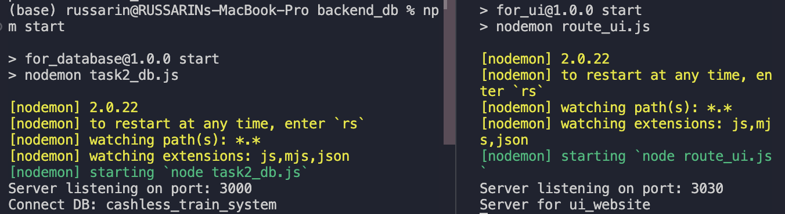

# How to start the web application of the prototype
1. Run the system-db.sql file in MySQL.
2. Adjust user configuration by changing the .env in the backend_db folder. 
3. Open the mock-up-prototype folder in any code editor such as VS Code.
4. Open 2 terminals.
5. cd backend_db folder in 1 terminal, type npm install, and then npm start.
6. cd front_ui folder in another terminal type npm install, and then npm start.
#### The terminals should show

7. Open http://localhost:3030/ in a web browser and adjust the screen size to iPhone 14 Pro Max.
